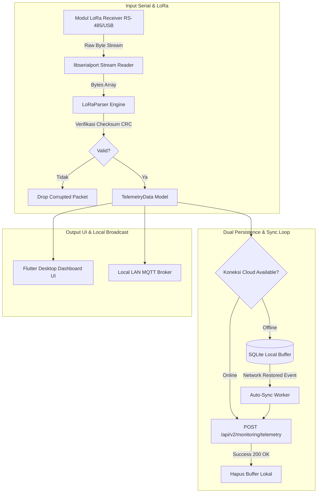

# Lobsense V2 - Edge Gateway Application

Aplikasi **Edge Lobsense** (Edge Gateway Desktop App) merupakan aplikasi desktop berbasis **Flutter (Windows Native)** yang bertindak sebagai stasion penerima frekuensi radio LoRa, penyimpan buffer data telemetri offline, pemroses keputusan lokal (*edge computing*), dan hub komunikasi jaringan lokal di lokasi tambak lobster.

---

## 1. Peran & Fungsi Edge Gateway dalam Sistem

Dalam ekosistem **Lobster Sensing System**, Edge Gateway bertindak sebagai perantara utama antara unit sensor/aktuator di keramba laut dengan server pusat Backend:

1. **Penerima Telemetri LoRa (LoRa Packet Receiver)**: Membaca aliran byte mentah (*raw stream*) dari modul penerima LoRa yang terhubung via port serial RS-485 / USB TTL.
2. **Buffer Persistence Offline (Offline Resilience)**: Ketika jaringan internet tambak terputus, Edge Gateway menyimpan seluruh data telemetri ke dalam database SQLite lokal terenkripsi.
3. **Penyinkronan Otomatis (Auto-Sync to Cloud)**: Saat koneksi internet kembali aktif, engine sinkronisasi mengunggah seluruh data ter-buffer ke Cloud Backend API tanpa kehilangan data (*zero data loss*).
4. **Pencegahan Kritis Lokal (Edge Actuator Control)**: Mengambil keputusan cepat untuk memicu relai aerator ketika kadar Oksigen Terlarut (DO) drop di bawah batas aman tanpa menunggu respon cloud.

---

## 2. Diagram Alur Data & State Machine Sinkronisasi Edge



---

## 3. Spesifikasi Fitur Utama

- **Header Status System**: Identitas resmi sistem **`Edge Lobsense / Lobster Sensing System`** dengan penanda versi dan indikator konektivitas.
- **Local Telemetry Dashboard**: Tampilan real-time indikator sensor pH, DO, TDS, Suhu Air, dan Turbiditas langsung dari stasion tepi.
- **LoRa Packet Parser (`LoRaParser`)**: Engine pengurai paket data biner LoRa dengan verifikasi checksum CRC16.
- **Serial Port Auto-Detector (`libserialport`)**: Pendeteksi port COM/TTY otomatis dengan konfigurasi baud rate dinamis.
- **Offline SQLite Buffering (`sqflite`)**: Penyimpanan antrean telemetri lokal transparan berbasis transaksi SQLite.
- **Local MQTT Broadcast**: Pemancar telemetri ke jaringan LAN lokal untuk konsumsi perangkat sekitar tambak.

---

## 4. Stack Teknologi & Library Desktop

- **Framework**: Flutter 3.24+ (Dart 3.5+, Target Native Windows C++)
- **Serial Communication**: `flutter_libserialport` / `libserialport` (Native C-binding RS-232/RS-485/USB-Serial)
- **Local Persistence**: `sqflite` / `sqflite_common_ffi` (Engine database SQLite lokal)
- **Networking**: `mqtt_client` (Local MQTT Broker Publisher), `http` (Cloud REST API Client)
- **Media Engine**: `media_kit` (Playback stream kamera CCTV lokal)

---

## 5. Panduan Compiling & Production Build (Windows Desktop)

### 5.1 Prasyarat Lingkungan
- Flutter SDK `>= 3.24.0`
- Visual Studio 2022 (dengan beban kerja *Desktop Development with C++*)
- Toolchain: CMake, Ninja, C++ Compiler

### 5.2 Perintah Build & Run

```bash
# 1. Masuk ke direktori EdgeApp
cd EdgeApp

# 2. Ambil paket dependensi Flutter
flutter pub get

# 3. Jalankan aplikasi dalam mode pengembangan (Windows Desktop)
flutter run -d windows

# 4. Buat kompilasi biner produksi (Release Build)
flutter build windows --release
```

File executable produksi (`.exe`) akan dihasilkan pada direktori:
`EdgeApp/build/windows/x64/runner/Release/`.
